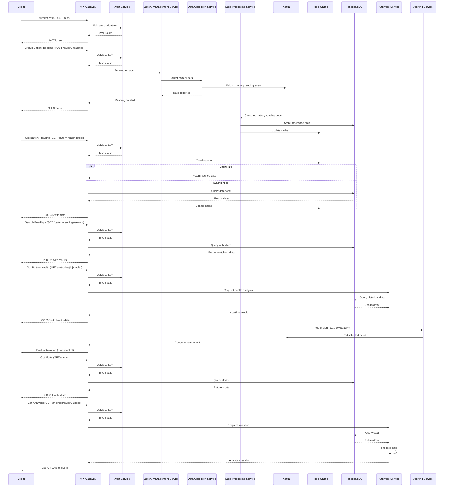

# Challenge 1: Battery Monitoring System

We have 1,000 batteries on the field. Tomorrow 10,000. We collect multiple parameters from
these batteries (IOT). Which architecture and technical solution would you suggest at scale?
How would you make this data useful and accessible for users?
This question is intentionally broadly formulated, so that you can propose your own
methodology and ask questions. In a second step, we’ll share additional questions to guide you.

## Which architecture and technical solution would you suggest at scale?

My Solution would be to use an event driven microservices architecture with a message bus to handle back pressure and scalability.

### Step 1: Core Architecture

At the heart of our  architecture, we'll use a microservices-based approach with event-driven communication. 
This allows for better scalability, fault isolation, and easier updates to individual components.

**Key components:**
1. API Gateway (using Go and Gin framework)
2. Data Collection Service
3. Data Processing Service
4. Analytics Service
5. Alerting Service
6. Authentication and Authorization Service

### Step 2: Data Ingestion and Storage

1. Use Apache Kafka for event streaming and as a buffer for incoming data.
2. Implement a Data Collection Service that handles TCP connections to batteries and pushes data to Kafka.
3. Use TimescaleDB (PostgreSQL extension) for time-series data storage, allowing efficient querying of historical data.
4. Implement Redis for caching frequently accessed data and as a quick storage for real-time data.

### Step 3: Data Processing

1. Implement a Data Processing Service that consumes events from Kafka, processes them, and stores the results in TimescaleDB.
2. Use Go for implementing the processing logic, taking advantage of its concurrency features.

### Step 4: Scalability and Performance

1. Deploy services on Kubernetes for easy scaling and management.
2. Implement horizontal scaling for the API Gateway, Data Collection, and Data Processing services.
3. Use database partitioning in TimescaleDB for efficient data management.
4. Implement caching strategies using Redis to reduce database load.

### Step 5: Security

1. Implement JWT for authentication and authorization.
2. Use HTTPS for all API communications.
3. Implement rate limiting to prevent abuse.
4. Use HashiCorp Vault for secrets management.

### Step 6: Monitoring and Alerting

1. Implement a comprehensive monitoring system using Prometheus and Grafana.
2. Set up an Alerting Service that consumes events from Kafka and sends notifications based on predefined rules.

### Step 7: Analytics

1. Implement an Analytics Service that processes data from TimescaleDB and provides insights.
2. Use materialized views in TimescaleDB for frequently accessed analytics queries.

### Step 8: Disaster Recovery and High Availability

1. Implement multi-region deployment for critical services.
2. Set up regular backups of TimescaleDB data.
3. Implement a fail-over mechanism for Kafka and TimescaleDB.

## 2. How would you make this data useful and accessible for users?

#### Step 1: API Development

1. Implement a comprehensive RESTFUL API using Go and Gin framework.
2. Follow OpenAPI specifications for clear API documentation.
3. Implement versioning (e.g., `/v1/batteries`) to allow for future changes without breaking existing integrations.

#### Step 2: Data Visualization

1. Develop web-based dashboards using a modern frontend framework (e.g., React, Vue.js).
2. Implement real-time updates in dashboards using WebSocket connections.
3. Create different views for different user roles (e.g., operations team, maintenance team, management).

#### Step 3: Reporting

1. Implement a reporting service that generates periodic reports (daily, weekly, monthly).
2. Allow users to schedule and customize reports based on their needs.
3. Provide export functionality in various formats (CSV, PDF, Excel).

#### Step 4: Mobile Application

1. Develop a mobile application for on-the-go access to critical information.
2. Implement push notifications for important alerts.

#### Step 5: Data Analytics and Insights

1. Implement machine learning models for predictive maintenance.
2. Provide trend analysis and forecasting features.
3. Implement anomaly detection to highlight unusual battery behavior.

#### Step 6: API Integration Support

1. Provide SDKs in popular programming languages for easy API integration.
2. Create detailed API documentation with usage examples.
3. Implement a developer portal for API key management and usage monitoring.

#### Step 7: Customizable Alerts

1. Allow users to set up custom alerts based on various parameters (e.g., low battery health, unusual discharge patterns).
2. Provide multiple notification channels (email, SMS, push notifications).

#### Step 8: Data Exploration Tools

1. Implement a query builder interface for ad-hoc data exploration.
2. Provide data visualization tools for creating custom charts and graphs.

#### Step 9: Accessibility and Usability

1. Implement responsive design for all web interfaces to ensure accessibility on various devices.
2. Conduct usability testing and gather user feedback for continuous improvement.
3. Provide user training and comprehensive help documentation.

#### Step 10: Data Privacy and Compliance

1. Implement role-based access control (RBAC) to ensure users only access data they're authorized to see.
2. Provide data anonymization options for sharing with external stakeholders.
3. Implement GDPR compliance measures, including data export and deletion capabilities.

